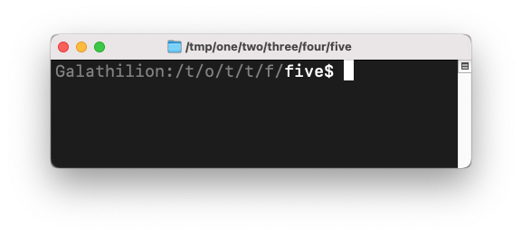

# Bash prompt tips

My current Bash prompt looks like this:



You may notice that I am six levels deep in a directory hierarchy (per the title bar) but that the prompt is still fairly manageable without taking up a whole line. I essentially abbreviate each folder above the current one to its first letter. If I need the full path, a) I have the titlebar, and b) I also have the `pwd` command. 

I use this because sometimes I will have similarly-named folders all across my systems, but just want a bit of a hint in the actual shell as to where I actually am, again, without completely taking up a line (or more) in my shell. 

Coloring aside, this is mostly accomplished with a small Perl script, [`pwd.pl`](pwd.pl), which cuts up the path based on slashes and appropriately abbreviates things. It also does some tilde substitution and ensures proper coloring when I am in a top-level folder such as `/tmp`. 

Aside from the script, the other trick here was getting coloring to work in both the normal `PS1` output as well as the output of the script which is evaluated in the prompt string. Hat tip to [this Stack Overflow post](https://stackoverflow.com/a/24840720/977220) which helped immensely. In short, all non-printable prompt commands such as color codes should be wrapped in `\[` and `\]` to not count against column width so that lines wrap properly. In a sourced script, you will need to convert these directly to their equivalent `\001` and `\002` since Bash won't do it for you. So I do that in the Perl script. I use Perl since essentially every system will ship with it automatically (I say this as someone who has been using Perl for 25 years now). 

Lastly, there are lots of [other places](https://duckduckgo.com/?q=bash+prompt+colors) to find out more about the color code aspects of Bash prompts. 

## Full shell command

This is what is in my `~/.bash_profile`:

```bash
GRAY="\[\e[90m\]"
RSET="\[\e[0m\]"
PS1="$GRAY\h:$RSET\$($HOME/bin/pwd.pl)\$ "; export PS1
```

